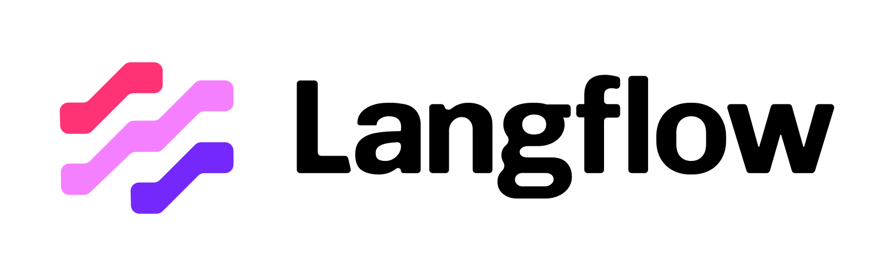

<!-- markdownlint-disable MD030 -->




[](https://github.com/langflow-ai/langflow/releases)
[](https://opensource.org/licenses/MIT)
[](https://pypistats.org/packages/langflow)
[](https://star-history.com/#langflow-ai/langflow)
[](https://github.com/langflow-ai/langflow/issues)
[](https://huggingface.co/spaces/Langflow/Langflow?duplicate=true)
[](https://twitter.com/langflow)
[](https://www.youtube.com/@Langflow)

**Nearflow** is a customized fork of [Langflow](https://github.com/logspace-ai/langflow) — a powerful visual interface for building AI agent flows — extended by [Vital Point](https://vitalpoint.ai) to enable building and deploying user-owned AI agents and workflows using Langflow's powerful interface.

[Langflow](https://langflow.org) provides developers with both a visual authoring experience and a built-in API server that turns every agent into an API endpoint that can be integrated into applications built on any framework or stack.

## ✨ Highlight features

1. **Integration** with [NEAR AI](https://near.ai) models, memory, agents, and vector stores
1. **Visual Builder** to get started quickly and iterate. 
1. **Access to Code** so developers can tweak any component using Python.
1. **Playground** to immediately test and iterate on flows with step-by-step control.
1. **Multi-agent** orchestration and conversation management and retrieval.
1. **Deploy as an API** or export as JSON for Python apps.
1. **Observability** with LangSmith, LangFuse and other integrations.
1. **Enterprise-ready** security and scalability.

## ⚡ Quick Start (Development)

Langflow works with Python 3.10 to 3.13.

```bash
git clone https://github.com/ALuhning/nearflow.git
cd nearflow
git checkout near-model

# You may want to create and activate a virtual environment (recommended)
python3.11 -m venv .venv
source .venv/bin/activate

# Install with all development extras
pip install -e .[dev]

# Run the development server
langflow run
```

## 🚀 Deploy to Production

1. Set your DNS to point to your production server.
2. Create a `.env` file (see `.env.template` for structure).
3. Run the following to deploy:

```bash
docker compose -f docker-compose.prod.yml up --build -d
docker compose -f docker-compose.prod.yml run --rm certbot
docker compose -f docker-compose.prod.yml up -d nginx

## 🔄 GitHub Actions CI/CD

Every push to the `near-model` branch automatically triggers a CI/CD pipeline that:

- 🔧 Builds a Docker image from the current source code
- 🐙 Pushes the image to GitHub Container Registry (GHCR)
- 🔐 Connects to your production server via SSH
- 📦 Pulls the latest image and restarts the `langflow` service
- 📄 Dynamically generates a `.env` file from GitHub Secrets

### 💡 How it works

The GitHub Actions workflow:

1. Reads `.env` values securely from **GitHub Secrets**
2. Writes them into a `.env` file on the CI runner
3. Builds and pushes the image to `ghcr.io/your-repo/nearflow`
4. SSHs into your server and:
   - Logs in to GHCR
   - Pulls the latest image
   - Replaces the old `.env` (optional)
   - Restarts Langflow using `docker-compose.prod.yml`

> The complete pipeline is defined in:  
> `.github/workflows/deploy.yml`

### 🛠 Secrets You Must Add in GitHub

Add these in your repo under  
**Settings → Secrets and variables → Actions → Secrets**:

| Secret Name                   | Description                        |
|-------------------------------|------------------------------------|
| `POSTGRES_USER`               | Database username                  |
| `POSTGRES_PASSWORD`           | Database password                  |
| `POSTGRES_DB`                 | Database name                      |
| `LANGFLOW_SUPERUSER`          | Login username                     |
| `LANGFLOW_SUPERUSER_PASSWORD` | Login password                     |
| `BACKEND_URL`                 | Your live URL (e.g. https://...)   |
| `GHCR_PAT`                    | GitHub Personal Access Token       |
| `PROD_SSH_HOST`               | Your server's IP or hostname       |
| `PROD_SSH_USER`               | Your server login user (e.g. root) |
| `PROD_SSH_KEY`                | Raw SSH private key (no passphrase)|

---

## 📚 Attribution

Nearflow is based on:

- [Langflow by Logspace](https://github.com/logspace-ai/langflow)
- [LangChain](https://www.langchain.com/)
- [NEAR AI](https://near.ai)

### Original Langflow creators:
- Carlos Coelho  
- Cristhian Zanforlin  
- Gabriel Almeida  
- Igor Carvalho  
- Lucas Eduoli  
- Otávio Anovazzi  
- Rodrigo Nader  
- Italo dos Anjos

### Fork customized and maintained by:
- Aaron Luhning — [Vital Point AI](https://vitalpoint.ai)

---

## 📄 License

This project is licensed under the MIT License.  
See the [LICENSE](./LICENSE) file for details.


## 📦 Deployment

### Self-managed

Nearflow is completely open source and you can deploy it in various ways. Follow this [guide](https://docs.langflow.org/deployment-docker) to learn how to use Docker to deploy.

## ⭐ Stay up-to-date

Star Nearflow on GitHub to be instantly notified of new releases.


## 👋 Contribute

We welcome contributions from developers of all levels. If you'd like to contribute, please check our [contributing guidelines](./CONTRIBUTING.md) and help make Nearflow more accessible.

---

[](https://www.star-history.com/#ALuhning/nearflow&Date)

## ❤️ Contributors

[](https://github.com/ALuhning/nearflow/graphs/contributors)

